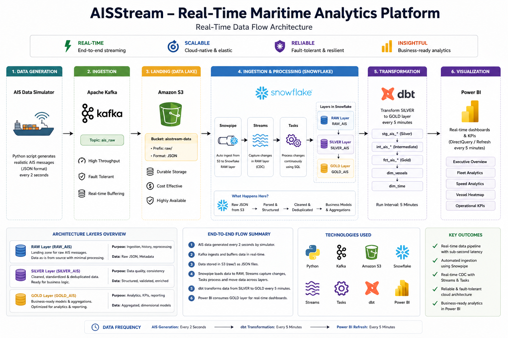

# Real-Time Maritime Analytics Pipeline

## AISStream → Kafka → S3 → Snowflake → dbt → Power BI

This project is a real-time data engineering pipeline that ingests live AIS maritime vessel data from AISStream WebSocket, streams it through Apache Kafka running on EC2 with Docker, stores raw JSON events in Amazon S3, loads data into Snowflake using Snowpipe auto-ingest, transforms raw data into clean Silver tables using Snowflake Streams and Tasks, builds Gold analytics models using dbt, and visualizes the final analytics layer in Power BI.

---

## Architecture Diagram

The following architecture shows the complete real-time data flow of the project, starting from AIS data generation and ending with business-ready dashboards in Power BI.


---

## Tech Stack

| Layer | Technology |
|---|---|
| Real-time Data Source | AISStream WebSocket API |
| Compute | Amazon EC2 |
| Containerization | Docker |
| Streaming Platform | Apache Kafka KRaft |
| Producer | Python |
| Consumer | Python |
| Raw Storage | Amazon S3 |
| Data Warehouse | Snowflake |
| Auto Ingestion | Snowpipe |
| Incremental Processing | Snowflake Streams & Tasks |
| Transformation Layer | dbt |
| Visualization | Power BI |
| Scheduling | Linux Cron |

---

## Project Goal

The goal of this project is to build an industry-style real-time streaming data pipeline for maritime vessel monitoring. The pipeline continuously captures live ship tracking data, stores raw events for auditing and reprocessing, transforms JSON data into clean analytical tables, creates business-ready Gold models, and visualizes vessel movement, speed, activity, and message trends in Power BI.

---

## Why This Project Is Strong

This project demonstrates multiple real-world data engineering skills:

- Real-time WebSocket data ingestion
- Kafka streaming with KRaft mode
- Docker-based service deployment on EC2
- Raw data storage in S3
- Snowflake external stage and storage integration
- Snowpipe auto-ingestion
- Snowflake Streams and Tasks for incremental transformation
- dbt models for Gold analytics layer
- Automated dbt scheduling using cron
- Power BI dashboarding on curated warehouse tables

---

# 1. EC2 Setup

## 1.1 Launch EC2 Instance

Create an EC2 instance using the AWS Console.

Recommended configuration:

```text
AMI: Ubuntu
Instance Type: t3.medium or higher
Storage: 20 GB or higher
Security Group:
  SSH Port 22 allowed from your IP
```

Connect using SSH:

```bash
ssh -i "your-key.pem" ubuntu@your-ec2-public-dns
```

Update packages:

```bash
sudo apt update && sudo apt upgrade -y
```

---

# 2. Docker Installation

Install Docker:

```bash
sudo apt install docker.io -y
```

Start and enable Docker:

```bash
sudo systemctl start docker
sudo systemctl enable docker
```

Allow Ubuntu user to run Docker:

```bash
sudo usermod -aG docker ubuntu
newgrp docker
```

Verify:

```bash
docker --version
docker run hello-world
```

Check status:

```bash
systemctl status docker
```

Expected:

```text
active (running)
```

---

# 3. Docker Compose Installation

If `docker compose` is not available, install standalone Docker Compose:

```bash
sudo curl -L "https://github.com/docker/compose/releases/download/v2.27.0/docker-compose-linux-x86_64" -o /usr/local/bin/docker-compose
sudo chmod +x /usr/local/bin/docker-compose
docker-compose --version
```

Expected:

```text
Docker Compose version v2.27.0
```

---

# 4. Project Directory Structure

Create the main project folder:

```bash
mkdir -p ~/ais-maritime-pipeline
cd ~/ais-maritime-pipeline
```

Final structure:

```text
ais-maritime-pipeline/
│
├── kafka/
│   └── docker-compose.yaml
│
├── producer/
│   ├── venv/
│   ├── .env
│   └── ais_to_kafka.py
│
├── consumer/
│   ├── test_s3.py
│   └── kafka_to_s3.py
│
└── dbt/
    ├── run_dbt.sh
    ├── dbt_run.log
    ├── profiles/
    │   └── profiles.yml
    └── ais_maritime_dbt/
        ├── dbt_project.yml
        └── models/
            └── gold/
```

---

# 5. Kafka Setup Using KRaft Mode

This project uses Kafka KRaft mode instead of ZooKeeper.

## 5.1 Create Kafka Folder

```bash
mkdir -p ~/ais-maritime-pipeline/kafka
cd ~/ais-maritime-pipeline/kafka
```

## 5.2 Create Docker Compose File

```bash
nano docker-compose.yaml
```

Paste:

```yaml
services:
  kafka:
    image: apache/kafka:3.9.0
    container_name: kafka

    ports:
      - "9092:9092"

    environment:
      KAFKA_NODE_ID: 1

      KAFKA_PROCESS_ROLES: broker,controller

      KAFKA_LISTENERS: PLAINTEXT://:9092,CONTROLLER://:9093

      KAFKA_ADVERTISED_LISTENERS: PLAINTEXT://localhost:9092

      KAFKA_CONTROLLER_LISTENER_NAMES: CONTROLLER

      KAFKA_LISTENER_SECURITY_PROTOCOL_MAP: CONTROLLER:PLAINTEXT,PLAINTEXT:PLAINTEXT

      KAFKA_CONTROLLER_QUORUM_VOTERS: 1@localhost:9093

      KAFKA_OFFSETS_TOPIC_REPLICATION_FACTOR: 1

      KAFKA_TRANSACTION_STATE_LOG_REPLICATION_FACTOR: 1

      KAFKA_TRANSACTION_STATE_LOG_MIN_ISR: 1

      KAFKA_GROUP_INITIAL_REBALANCE_DELAY_MS: 0

      CLUSTER_ID: MkU3OEVBNTcwNTJENDM2Qk
```

## 5.3 Start Kafka

```bash
docker-compose up -d
```

Verify container:

```bash
docker ps
```

Check Kafka logs:

```bash
docker logs kafka --tail 50
```

---

# 6. Create Kafka Topic

Create topic:

```bash
docker exec kafka /opt/kafka/bin/kafka-topics.sh \
--create \
--topic ais_raw_events \
--bootstrap-server localhost:9092 \
--partitions 3 \
--replication-factor 1
```

Verify:

```bash
docker exec kafka /opt/kafka/bin/kafka-topics.sh \
--list \
--bootstrap-server localhost:9092
```

Expected output:

```text
ais_raw_events
```

---

# 7. AISStream Producer Setup

The producer connects to AISStream WebSocket and sends live events to Kafka.

## 7.1 Create Producer Folder

```bash
cd ~/ais-maritime-pipeline
mkdir -p producer
cd producer
```

## 7.2 Install Python venv Support

If venv is missing:

```bash
sudo apt install python3.14-venv -y
```

Create virtual environment:

```bash
python3 -m venv venv
source venv/bin/activate
```

Install required packages:

```bash
pip install websockets python-dotenv kafka-python
```

Verify:

```bash
pip list
```

Expected packages:

```text
websockets
python-dotenv
kafka-python
```

---

## 7.3 Create .env File

```bash
nano .env
```

Paste:

```env
AISSTREAM_API_KEY=your_aisstream_api_key_here
KAFKA_BOOTSTRAP_SERVER=localhost:9092
KAFKA_TOPIC=ais_raw_events
```

Do not push `.env` to GitHub.

---

## 7.4 Create Producer Script

```bash
nano ais_to_kafka.py
```

Paste:

```python
import asyncio
import json
import os
import time
import websockets
from dotenv import load_dotenv
from kafka import KafkaProducer

load_dotenv()

AISSTREAM_API_KEY = os.getenv("AISSTREAM_API_KEY")
KAFKA_BOOTSTRAP_SERVER = os.getenv("KAFKA_BOOTSTRAP_SERVER")
KAFKA_TOPIC = os.getenv("KAFKA_TOPIC")

producer = KafkaProducer(
    bootstrap_servers=KAFKA_BOOTSTRAP_SERVER,
    value_serializer=lambda v: json.dumps(v).encode("utf-8")
)

async def main():

    async with websockets.connect(
        "wss://stream.aisstream.io/v0/stream"
    ) as websocket:

        subscribe_message = {
            "APIKey": AISSTREAM_API_KEY,
            "BoundingBoxes": [
                [[-90, -180], [90, 180]]
            ]
        }

        await websocket.send(
            json.dumps(subscribe_message)
        )

        print("Connected to AISStream...")
        print("Sending data to Kafka...")

        async for message in websocket:

            data = json.loads(message)

            event = {
                "ingestion_time": int(time.time()),
                "raw_data": data
            }

            producer.send(
                KAFKA_TOPIC,
                value=event
            )

            producer.flush()

            print("Event sent to Kafka")

asyncio.run(main())
```

---

## 7.5 Run Producer

```bash
cd ~/ais-maritime-pipeline/producer
source venv/bin/activate
python ais_to_kafka.py
```

Expected output:

```text
Connected to AISStream...
Sending data to Kafka...
Event sent to Kafka
Event sent to Kafka
```

---

# 8. Verify Kafka Consumer Manually

Open another SSH terminal and run:

```bash
docker exec -it kafka /opt/kafka/bin/kafka-console-consumer.sh \
--bootstrap-server localhost:9092 \
--topic ais_raw_events \
--from-beginning
```

Expected output should be JSON messages like:

```json
{
  "ingestion_time": 1780404218,
  "raw_data": {
    "MessageType": "PositionReport",
    "MetaData": {
      "MMSI": 367482550,
      "ShipName": "WILLIAM P HOBBY",
      "latitude": 29.76478,
      "longitude": -95.07897
    }
  }
}
```

---

# 9. S3 Raw Layer Setup

## 9.1 Create S3 Bucket

Create bucket from AWS Console:

```text
Bucket Name: ais-maritime-raw-uzair
Region: us-east-1
```

Inside the bucket, create:

```text
raw/
└── ais/
```

Final path:

```text
s3://ais-maritime-raw-uzair/raw/ais/
```

---

## 9.2 Attach IAM Role to EC2

Create or attach an IAM role to EC2 with S3 access.

Recommended permission for project/demo:

```text
AmazonS3FullAccess
```

Production would use least privilege.

If EC2 cannot assume role, update IAM Role Trust Policy:

```json
{
  "Version": "2012-10-17",
  "Statement": [
    {
      "Effect": "Allow",
      "Principal": {
        "Service": "ec2.amazonaws.com"
      },
      "Action": "sts:AssumeRole"
    }
  ]
}
```

Verify metadata credentials:

```bash
TOKEN=$(curl -X PUT "http://169.254.169.254/latest/api/token" \
-H "X-aws-ec2-metadata-token-ttl-seconds: 21600")

curl -H "X-aws-ec2-metadata-token: $TOKEN" \
http://169.254.169.254/latest/meta-data/iam/security-credentials/
```

---

# 10. Kafka Consumer to S3

## 10.1 Create Consumer Folder

```bash
cd ~/ais-maritime-pipeline
mkdir -p consumer
cd consumer
```

Use producer venv:

```bash
source ../producer/venv/bin/activate
```

Install boto3:

```bash
pip install boto3
```

---

## 10.2 Test S3 Access

Create test file:

```bash
nano test_s3.py
```

Paste:

```python
import boto3

s3 = boto3.client("s3")

response = s3.list_buckets()

for bucket in response["Buckets"]:
    print(bucket["Name"])
```

Run:

```bash
python test_s3.py
```

Expected output should include:

```text
ais-maritime-raw-uzair
```

---

## 10.3 Create Kafka to S3 Consumer

```bash
nano kafka_to_s3.py
```

Paste:

```python
import json
import time
import uuid
from datetime import datetime, timezone

import boto3
from kafka import KafkaConsumer

BUCKET_NAME = "ais-maritime-raw-uzair"
TOPIC_NAME = "ais_raw_events"
BOOTSTRAP_SERVER = "localhost:9092"

s3 = boto3.client("s3")

consumer = KafkaConsumer(
    TOPIC_NAME,
    bootstrap_servers=BOOTSTRAP_SERVER,
    auto_offset_reset="latest",
    enable_auto_commit=True,
    group_id="ais-s3-consumer-group",
    value_deserializer=lambda x: json.loads(x.decode("utf-8"))
)

buffer = []
BATCH_SIZE = 500
FLUSH_INTERVAL_SECONDS = 30
last_flush_time = time.time()

def upload_to_s3(events):
    now = datetime.now(timezone.utc)

    key = (
        f"raw/ais/"
        f"year={now.year}/"
        f"month={now.month:02d}/"
        f"day={now.day:02d}/"
        f"hour={now.hour:02d}/"
        f"ais_events_{uuid.uuid4()}.json"
    )

    body = "\n".join(json.dumps(event) for event in events)

    s3.put_object(
        Bucket=BUCKET_NAME,
        Key=key,
        Body=body.encode("utf-8"),
        ContentType="application/json"
    )

    print(f"Uploaded {len(events)} events to s3://{BUCKET_NAME}/{key}")

print("Kafka consumer started...")
print(f"Reading from topic: {TOPIC_NAME}")

for message in consumer:
    buffer.append(message.value)

    current_time = time.time()

    if len(buffer) >= BATCH_SIZE or (current_time - last_flush_time) >= FLUSH_INTERVAL_SECONDS:
        upload_to_s3(buffer)
        buffer = []
        last_flush_time = current_time
```

Run:

```bash
python kafka_to_s3.py
```

Expected output:

```text
Kafka consumer started...
Uploaded 500 events to s3://ais-maritime-raw-uzair/raw/ais/year=2026/month=06/day=02/hour=14/...
```

---

# 11. Snowflake Setup

## 11.1 Create Database and Schemas

Run in Snowflake:

```sql
USE ROLE ACCOUNTADMIN;
USE WAREHOUSE COMPUTE_WH;

CREATE DATABASE IF NOT EXISTS AIS_MARITIME_DB;

CREATE SCHEMA IF NOT EXISTS AIS_MARITIME_DB.RAW;
CREATE SCHEMA IF NOT EXISTS AIS_MARITIME_DB.SILVER;
CREATE SCHEMA IF NOT EXISTS AIS_MARITIME_DB.GOLD;

SHOW DATABASES LIKE 'AIS_MARITIME_DB';
SHOW SCHEMAS IN DATABASE AIS_MARITIME_DB;
```

---

## 11.2 Create File Format and RAW Table

```sql
USE ROLE ACCOUNTADMIN;
USE WAREHOUSE COMPUTE_WH;
USE DATABASE AIS_MARITIME_DB;
USE SCHEMA RAW;

CREATE OR REPLACE FILE FORMAT AIS_JSON_FORMAT
TYPE = JSON
STRIP_OUTER_ARRAY = FALSE;

CREATE OR REPLACE TABLE RAW_AIS_EVENTS (
    raw_event VARIANT,
    file_name STRING,
    loaded_at TIMESTAMP_NTZ DEFAULT CURRENT_TIMESTAMP()
);
```

---

# 12. Snowflake Storage Integration

## 12.1 Create IAM Role for Snowflake

In AWS IAM, create role:

```text
snowflake-s3-role
```

Attach policy:

```json
{
  "Version": "2012-10-17",
  "Statement": [
    {
      "Effect": "Allow",
      "Action": [
        "s3:GetObject",
        "s3:ListBucket"
      ],
      "Resource": [
        "arn:aws:s3:::ais-maritime-raw-uzair",
        "arn:aws:s3:::ais-maritime-raw-uzair/*"
      ]
    }
  ]
}
```

---

## 12.2 Create Storage Integration in Snowflake

Replace role ARN with your AWS role ARN.

```sql
USE ROLE ACCOUNTADMIN;

CREATE OR REPLACE STORAGE INTEGRATION AIS_S3_INTEGRATION
TYPE = EXTERNAL_STAGE
STORAGE_PROVIDER = 'S3'
ENABLED = TRUE
STORAGE_AWS_ROLE_ARN = 'arn:aws:iam::<YOUR_AWS_ACCOUNT_ID>:role/snowflake-s3-role'
STORAGE_ALLOWED_LOCATIONS = ('s3://ais-maritime-raw-uzair/raw/ais/');
```

Describe integration:

```sql
DESC INTEGRATION AIS_S3_INTEGRATION;
```

Copy:

```text
STORAGE_AWS_IAM_USER_ARN
STORAGE_AWS_EXTERNAL_ID
```

---

## 12.3 Update IAM Role Trust Policy

In AWS:

```text
IAM → Roles → snowflake-s3-role → Trust relationships → Edit trust policy
```

Use Snowflake-generated IAM user ARN and External ID:

```json
{
  "Version": "2012-10-17",
  "Statement": [
    {
      "Effect": "Allow",
      "Principal": {
        "AWS": "<STORAGE_AWS_IAM_USER_ARN>"
      },
      "Action": "sts:AssumeRole",
      "Condition": {
        "StringEquals": {
          "sts:ExternalId": "<STORAGE_AWS_EXTERNAL_ID>"
        }
      }
    }
  ]
}
```

---

# 13. Create External Stage

```sql
USE ROLE ACCOUNTADMIN;
USE DATABASE AIS_MARITIME_DB;
USE SCHEMA RAW;

CREATE OR REPLACE STAGE AIS_S3_STAGE
URL = 's3://ais-maritime-raw-uzair/raw/ais/'
STORAGE_INTEGRATION = AIS_S3_INTEGRATION
FILE_FORMAT = AIS_JSON_FORMAT;

LIST @AIS_S3_STAGE;
```

If files are listed, S3 to Snowflake connection is working.

---

# 14. Manual Load Test

Before Snowpipe, manually test load:

```sql
USE DATABASE AIS_MARITIME_DB;
USE SCHEMA RAW;

COPY INTO RAW_AIS_EVENTS (raw_event)
FROM (
    SELECT $1
    FROM @AIS_S3_STAGE
)
FILE_FORMAT = (FORMAT_NAME = AIS_JSON_FORMAT)
ON_ERROR = CONTINUE;
```

Check count:

```sql
SELECT COUNT(*) FROM RAW_AIS_EVENTS;
```

Preview:

```sql
SELECT * FROM RAW_AIS_EVENTS LIMIT 5;
```

---

# 15. Create Silver Parsed Table

This first Silver table parses JSON into relational columns.

```sql
USE DATABASE AIS_MARITIME_DB;
USE SCHEMA SILVER;

CREATE OR REPLACE TABLE SILVER_VESSEL_POSITIONS AS
SELECT

raw_event:raw_data:MetaData:MMSI::NUMBER AS MMSI,

raw_event:raw_data:MetaData:ShipName::STRING AS SHIP_NAME,

raw_event:raw_data:MetaData:latitude::FLOAT AS LATITUDE,

raw_event:raw_data:MetaData:longitude::FLOAT AS LONGITUDE,

raw_event:raw_data:MetaData:time_utc::STRING AS EVENT_TIME,

raw_event:raw_data:MessageType::STRING AS MESSAGE_TYPE,

raw_event:raw_data:Message:PositionReport:Sog::FLOAT AS SPEED,

raw_event:raw_data:Message:PositionReport:Cog::FLOAT AS COURSE,

loaded_at

FROM AIS_MARITIME_DB.RAW.RAW_AIS_EVENTS;
```

Then rename it as a raw parsed Silver layer:

```sql
ALTER TABLE SILVER_VESSEL_POSITIONS
RENAME TO SILVER_VESSEL_POSITIONS_RAW;
```

---

# 16. Create Clean Silver Table

This is where real transformations happen.

```sql
USE DATABASE AIS_MARITIME_DB;
USE SCHEMA SILVER;

CREATE OR REPLACE TABLE SILVER_VESSEL_POSITIONS_CLEAN AS

SELECT

    MMSI,

    TRIM(SHIP_NAME) AS SHIP_NAME,

    LATITUDE,

    LONGITUDE,

    COALESCE(SPEED,0) AS SPEED,

    COURSE,

    MESSAGE_TYPE,

    CASE
        WHEN COALESCE(SPEED,0) > 0
        THEN 'MOVING'
        ELSE 'STOPPED'
    END AS VESSEL_STATUS,

    TRY_TO_TIMESTAMP_NTZ(
        SPLIT_PART(EVENT_TIME,' +',1)
    ) AS EVENT_TIMESTAMP,

    LOADED_AT

FROM SILVER_VESSEL_POSITIONS_RAW

WHERE MMSI IS NOT NULL

AND LATITUDE BETWEEN -90 AND 90

AND LONGITUDE BETWEEN -180 AND 180

QUALIFY ROW_NUMBER() OVER (
    PARTITION BY MMSI,
                 EVENT_TIME,
                 LATITUDE,
                 LONGITUDE
    ORDER BY LOADED_AT DESC
)=1;
```

Transformations applied:

| Transformation | Purpose |
|---|---|
| `TRIM(SHIP_NAME)` | Removes extra spaces |
| `COALESCE(SPEED, 0)` | Handles null speed |
| `CASE WHEN SPEED > 0` | Creates MOVING / STOPPED status |
| `TRY_TO_TIMESTAMP_NTZ` | Converts string time to timestamp |
| Lat/Lon validation | Removes invalid geo records |
| `ROW_NUMBER()` | Removes duplicates |

---

# 17. Snowflake Stream

Create stream on RAW table:

```sql
USE DATABASE AIS_MARITIME_DB;
USE SCHEMA RAW;

CREATE OR REPLACE STREAM RAW_AIS_EVENTS_STREAM
ON TABLE RAW_AIS_EVENTS
APPEND_ONLY = TRUE;

SHOW STREAMS;
```

The stream tracks newly inserted records in `RAW_AIS_EVENTS`.

---

# 18. Snowflake Task for RAW to SILVER

Create task:

```sql
USE ROLE ACCOUNTADMIN;
USE WAREHOUSE COMPUTE_WH;
USE DATABASE AIS_MARITIME_DB;
USE SCHEMA RAW;

CREATE OR REPLACE TASK RAW_AIS_TO_SILVER_TASK
WAREHOUSE = COMPUTE_WH
SCHEDULE = '1 MINUTE'
WHEN SYSTEM$STREAM_HAS_DATA('RAW_AIS_EVENTS_STREAM')
AS
INSERT INTO AIS_MARITIME_DB.SILVER.SILVER_VESSEL_POSITIONS_CLEAN
SELECT
    raw_event:raw_data:MetaData:MMSI::NUMBER AS MMSI,
    TRIM(raw_event:raw_data:MetaData:ShipName::STRING) AS SHIP_NAME,
    raw_event:raw_data:MetaData:latitude::FLOAT AS LATITUDE,
    raw_event:raw_data:MetaData:longitude::FLOAT AS LONGITUDE,
    COALESCE(raw_event:raw_data:Message:PositionReport:Sog::FLOAT, 0) AS SPEED,
    raw_event:raw_data:Message:PositionReport:Cog::FLOAT AS COURSE,
    raw_event:raw_data:MessageType::STRING AS MESSAGE_TYPE,
    CASE
        WHEN COALESCE(raw_event:raw_data:Message:PositionReport:Sog::FLOAT, 0) > 0
        THEN 'MOVING'
        ELSE 'STOPPED'
    END AS VESSEL_STATUS,
    TRY_TO_TIMESTAMP_NTZ(
        SPLIT_PART(raw_event:raw_data:MetaData:time_utc::STRING, ' +', 1)
    ) AS EVENT_TIMESTAMP,
    loaded_at
FROM RAW_AIS_EVENTS_STREAM
WHERE raw_event:raw_data:MetaData:MMSI IS NOT NULL
  AND raw_event:raw_data:MetaData:latitude::FLOAT BETWEEN -90 AND 90
  AND raw_event:raw_data:MetaData:longitude::FLOAT BETWEEN -180 AND 180;
```

Start task:

```sql
ALTER TASK RAW_AIS_TO_SILVER_TASK RESUME;
```

Check tasks:

```sql
SHOW TASKS;
```

---

# 19. Snowpipe Auto-Ingest

## 19.1 Create Snowpipe

```sql
USE ROLE ACCOUNTADMIN;
USE DATABASE AIS_MARITIME_DB;
USE SCHEMA RAW;

CREATE OR REPLACE PIPE AIS_RAW_PIPE
AUTO_INGEST = TRUE
AS
COPY INTO RAW_AIS_EVENTS(raw_event)
FROM (
    SELECT $1
    FROM @AIS_S3_STAGE
)
FILE_FORMAT = (FORMAT_NAME = AIS_JSON_FORMAT)
ON_ERROR = CONTINUE;
```

Describe pipe:

```sql
DESC PIPE AIS_RAW_PIPE;
```

Copy:

```text
notification_channel
```

It will look like:

```text
arn:aws:sqs:us-east-1:442421142996:sf-snowpipe-...
```

---

## 19.2 Configure S3 Event Notification

Go to:

```text
S3 → ais-maritime-raw-uzair → Properties → Event notifications → Create event notification
```

Set:

```text
Event name: snowpipe-ais-raw-event
Prefix: raw/ais/
Suffix: .json
Event types: All object create events
Destination: SQS queue
SQS queue ARN: <notification_channel_from_snowflake>
```

---

## 19.3 Refresh Pipe Once

```sql
ALTER PIPE AIS_RAW_PIPE REFRESH;
```

Check pipe status:

```sql
SELECT SYSTEM$PIPE_STATUS('AIS_RAW_PIPE');
```

Expected:

```json
{
  "executionState": "RUNNING"
}
```

Check copy history:

```sql
SELECT *
FROM TABLE(INFORMATION_SCHEMA.COPY_HISTORY(
  TABLE_NAME=>'RAW_AIS_EVENTS',
  START_TIME=>DATEADD(hours,-1,CURRENT_TIMESTAMP())
))
ORDER BY LAST_LOAD_TIME DESC;
```

Expected status:

```text
Loaded
```

---

# 20. dbt Setup Using Docker

Because Python 3.14 caused compatibility issues with dbt, this project uses the official dbt Snowflake Docker image.

## 20.1 Pull dbt Snowflake Image

```bash
cd ~/ais-maritime-pipeline

mkdir -p dbt/ais_maritime_dbt
cd dbt

docker pull ghcr.io/dbt-labs/dbt-snowflake:1.8.0
```

Verify:

```bash
docker run --rm ghcr.io/dbt-labs/dbt-snowflake:1.8.0 --version
```

---

## 20.2 Create dbt Folder Structure

```bash
cd ~/ais-maritime-pipeline/dbt

mkdir -p profiles
mkdir -p ais_maritime_dbt/models/gold
```

---

## 20.3 Create profiles.yml

```bash
nano profiles/profiles.yml
```

Paste:

```yaml
ais_maritime_dbt:
  target: dev

  outputs:
    dev:
      type: snowflake

      account: XA14199.ap-south-1.aws

      user: YOUR_SNOWFLAKE_USERNAME
      password: YOUR_SNOWFLAKE_PASSWORD

      role: ACCOUNTADMIN
      database: AIS_MARITIME_DB
      warehouse: COMPUTE_WH
      schema: GOLD

      threads: 4
      client_session_keep_alive: False
```

---

## 20.4 Create dbt_project.yml

```bash
nano ais_maritime_dbt/dbt_project.yml
```

Paste:

```yaml
name: 'ais_maritime_dbt'

version: '1.0.0'

config-version: 2

profile: 'ais_maritime_dbt'

model-paths: ["models"]

models:
  ais_maritime_dbt:
    gold:
      +materialized: table
```

---

# 21. dbt Gold Models

All dbt models are stored in:

```text
~/ais-maritime-pipeline/dbt/ais_maritime_dbt/models/gold/
```

---

## 21.1 GOLD_ACTIVE_VESSELS

```bash
nano ais_maritime_dbt/models/gold/gold_active_vessels.sql
```

```sql
SELECT

    DATE_TRUNC('hour', EVENT_TIMESTAMP) AS EVENT_HOUR,

    COUNT(DISTINCT MMSI) AS ACTIVE_VESSELS

FROM AIS_MARITIME_DB.SILVER.SILVER_VESSEL_POSITIONS_CLEAN

GROUP BY 1
```

---

## 21.2 GOLD_MOVING_VS_STOPPED

```bash
nano ais_maritime_dbt/models/gold/gold_moving_vs_stopped.sql
```

```sql
SELECT
    VESSEL_STATUS,
    COUNT(*) AS TOTAL_EVENTS,
    COUNT(DISTINCT MMSI) AS UNIQUE_VESSELS
FROM AIS_MARITIME_DB.SILVER.SILVER_VESSEL_POSITIONS_CLEAN
GROUP BY 1
```

---

## 21.3 GOLD_FASTEST_VESSELS

```bash
nano ais_maritime_dbt/models/gold/gold_fastest_vessels.sql
```

```sql
SELECT
    MMSI,
    SHIP_NAME,
    MAX(SPEED) AS MAX_SPEED,
    AVG(SPEED) AS AVG_SPEED,
    COUNT(*) AS TOTAL_EVENTS
FROM AIS_MARITIME_DB.SILVER.SILVER_VESSEL_POSITIONS_CLEAN
WHERE SPEED > 0
GROUP BY 1, 2
ORDER BY MAX_SPEED DESC
LIMIT 50
```

---

## 21.4 GOLD_MESSAGE_DISTRIBUTION

```bash
nano ais_maritime_dbt/models/gold/gold_message_distribution.sql
```

```sql
SELECT
    MESSAGE_TYPE,
    COUNT(*) AS TOTAL_MESSAGES,
    COUNT(DISTINCT MMSI) AS UNIQUE_VESSELS
FROM AIS_MARITIME_DB.SILVER.SILVER_VESSEL_POSITIONS_CLEAN
GROUP BY 1
```

---

## 21.5 GOLD_VESSEL_HEATMAP

```bash
nano ais_maritime_dbt/models/gold/gold_vessel_heatmap.sql
```

```sql
SELECT
    ROUND(LATITUDE, 1) AS LAT_BUCKET,
    ROUND(LONGITUDE, 1) AS LON_BUCKET,
    COUNT(*) AS TOTAL_EVENTS,
    COUNT(DISTINCT MMSI) AS UNIQUE_VESSELS
FROM AIS_MARITIME_DB.SILVER.SILVER_VESSEL_POSITIONS_CLEAN
GROUP BY 1, 2
```

---

## 21.6 GOLD_SPEED_ANALYTICS

```bash
nano ais_maritime_dbt/models/gold/gold_speed_analytics.sql
```

```sql
SELECT
    DATE_TRUNC('hour', EVENT_TIMESTAMP) AS EVENT_HOUR,
    AVG(SPEED) AS AVG_SPEED,
    MAX(SPEED) AS MAX_SPEED,
    COUNT(*) AS TOTAL_EVENTS
FROM AIS_MARITIME_DB.SILVER.SILVER_VESSEL_POSITIONS_CLEAN
WHERE SPEED IS NOT NULL
GROUP BY 1
```

---

## 21.7 GOLD_TOP_ACTIVE_VESSELS

```bash
nano ais_maritime_dbt/models/gold/gold_top_active_vessels.sql
```

```sql
SELECT
    MMSI,
    SHIP_NAME,
    COUNT(*) AS TOTAL_MESSAGES,
    COUNT(DISTINCT DATE_TRUNC('hour', EVENT_TIMESTAMP)) AS ACTIVE_HOURS
FROM AIS_MARITIME_DB.SILVER.SILVER_VESSEL_POSITIONS_CLEAN
GROUP BY 1, 2
ORDER BY TOTAL_MESSAGES DESC
LIMIT 50
```

---

# 22. Run dbt

Run all models:

```bash
cd ~/ais-maritime-pipeline/dbt

docker run --rm \
--network host \
-v $(pwd)/ais_maritime_dbt:/usr/app \
-v $(pwd)/profiles:/root/.dbt \
-w /usr/app \
ghcr.io/dbt-labs/dbt-snowflake:1.8.0 \
run
```

Expected:

```text
Completed successfully
PASS=7
```

Check tables in Snowflake:

```sql
SHOW TABLES IN SCHEMA AIS_MARITIME_DB.GOLD;
```

---

# 23. Schedule dbt Every 5 Minutes

## 23.1 Create Run Script

```bash
cd ~/ais-maritime-pipeline/dbt
nano run_dbt.sh
```

Paste:

```bash
#!/bin/bash

cd /home/ubuntu/ais-maritime-pipeline/dbt

docker run --rm \
--network host \
-v /home/ubuntu/ais-maritime-pipeline/dbt/ais_maritime_dbt:/usr/app \
-v /home/ubuntu/ais-maritime-pipeline/dbt/profiles:/root/.dbt \
-w /usr/app \
ghcr.io/dbt-labs/dbt-snowflake:1.8.0 \
run >> /home/ubuntu/ais-maritime-pipeline/dbt/dbt_run.log 2>&1
```

Make executable:

```bash
chmod +x run_dbt.sh
```

Test:

```bash
./run_dbt.sh
tail -50 dbt_run.log
```

Expected:

```text
Completed successfully
```

---

## 23.2 Add Cron Schedule

```bash
crontab -e
```

Choose nano by pressing:

```text
1
```

Add line at the bottom:

```bash
*/5 * * * * /home/ubuntu/ais-maritime-pipeline/dbt/run_dbt.sh
```

Verify:

```bash
crontab -l
```

Check cron:

```bash
systemctl status cron
```

Expected:

```text
active (running)
```

Now dbt runs every 5 minutes.

---

# 24. Power BI Dashboard

## 24.1 Connect Power BI to Snowflake

In Power BI Desktop:

```text
Get Data → Snowflake
```

Server:

```text
XA14199.ap-south-1.aws.snowflakecomputing.com
```

Warehouse:

```text
COMPUTE_WH
```

Authentication:

```text
Username / Password
```

Select:

```text
Database: AIS_MARITIME_DB
Schema: GOLD
```

Load tables:

```text
GOLD_ACTIVE_VESSELS
GOLD_MOVING_VS_STOPPED
GOLD_FASTEST_VESSELS
GOLD_MESSAGE_DISTRIBUTION
GOLD_VESSEL_HEATMAP
GOLD_SPEED_ANALYTICS
GOLD_TOP_ACTIVE_VESSELS
```

Recommended mode:

```text
Import
```

DirectQuery can also be used for near real-time dashboards, but Import mode gives better performance and lower Snowflake query cost.

---

## 24.2 Dashboard Page

Page name:

```text
Executive Overview
```

Title:

```text
Real-Time Maritime Vessel Monitoring Dashboard
```

---

## 24.3 KPI Cards

Create 5 KPI cards:

| Card | Table | Field | Aggregation |
|---|---|---|---|
| Active Vessels | GOLD_ACTIVE_VESSELS | ACTIVE_VESSELS | Max |
| Average Speed | GOLD_SPEED_ANALYTICS | AVG_SPEED | Max |
| Total Messages | GOLD_MESSAGE_DISTRIBUTION | TOTAL_MESSAGES | Sum |
| Top Vessel Messages | GOLD_TOP_ACTIVE_VESSELS | TOTAL_MESSAGES | Max |
| Fastest Speed | GOLD_FASTEST_VESSELS | MAX_SPEED | Max |

---

## 24.4 Charts

### Active Vessel Trend

Visual:

```text
Line Chart
```

Fields:

```text
X-axis: EVENT_HOUR
Y-axis: ACTIVE_VESSELS
```

Table:

```text
GOLD_ACTIVE_VESSELS
```

---

### Top 10 Fastest Vessels

Visual:

```text
Clustered Bar Chart
```

Fields:

```text
Y-axis: SHIP_NAME
X-axis: MAX_SPEED
```

Table:

```text
GOLD_FASTEST_VESSELS
```

Filter:

```text
Top N = 10 by MAX_SPEED
```

---

### Moving vs Stopped

Visual:

```text
Donut Chart
```

Fields:

```text
Legend: VESSEL_STATUS
Values: UNIQUE_VESSELS
```

Table:

```text
GOLD_MOVING_VS_STOPPED
```

---

### Top Active Vessels

Visual:

```text
Table
```

Fields:

```text
SHIP_NAME
TOTAL_MESSAGES
ACTIVE_HOURS
```

Table:

```text
GOLD_TOP_ACTIVE_VESSELS
```

---

### Speed Trend

Visual:

```text
Line Chart
```

Fields:

```text
X-axis: EVENT_HOUR
Y-axis: AVG_SPEED
```

Table:

```text
GOLD_SPEED_ANALYTICS
```

---

# 25. Restarting the Project After EC2 Stop/Start

When EC2 is stopped and started again, run these commands.

## 25.1 Start Kafka

```bash
cd ~/ais-maritime-pipeline/kafka
docker-compose up -d
docker ps
```

## 25.2 Start Consumer

Terminal 1:

```bash
cd ~/ais-maritime-pipeline/consumer
source ../producer/venv/bin/activate
python kafka_to_s3.py
```

## 25.3 Start Producer

Terminal 2:

```bash
cd ~/ais-maritime-pipeline/producer
source venv/bin/activate
python ais_to_kafka.py
```

## 25.4 Check Snowpipe

Snowflake:

```sql
SELECT SYSTEM$PIPE_STATUS('AIS_RAW_PIPE');
```

Expected:

```text
RUNNING
```

## 25.5 Check Task

```sql
SHOW TASKS;
```

or

```sql
SELECT *
FROM TABLE(INFORMATION_SCHEMA.TASK_HISTORY(
TASK_NAME=>'RAW_AIS_TO_SILVER_TASK'
))
ORDER BY SCHEDULED_TIME DESC;
```

## 25.6 Check dbt Scheduler

```bash
crontab -l
systemctl status cron
tail -50 /home/ubuntu/ais-maritime-pipeline/dbt/dbt_run.log
```

---

# 26. Important Concepts

## RAW Layer

Stores original JSON without changing anything.

Purpose:

```text
Audit
Replay
Reprocessing
Debugging
```

---

## SILVER Layer

Stores cleaned, structured data.

Transformations:

```text
JSON parsing
Null handling
Duplicate removal
Timestamp conversion
Lat/Lon validation
Derived vessel status
```

---

## GOLD Layer

Stores dashboard-ready analytics.

Examples:

```text
Active Vessels by Hour
Moving vs Stopped
Fastest Vessels
Message Distribution
Speed Analytics
Top Active Vessels
Heatmap Dataset
```

---

## Snowflake Stream

A stream does not store data permanently. It tracks new rows inserted into the RAW table.

```text
RAW_AIS_EVENTS
     ↓
RAW_AIS_EVENTS_STREAM detects new rows
```

---

## Snowflake Task

A task runs SQL on a schedule. In this project, it runs every 1 minute when the stream has data.

```text
Stream detects new data
Task transforms it into Silver table
```

---

## dbt Role

dbt manages the Gold analytics layer.

Benefits:

```text
Modular SQL
Reusable models
Business-ready Gold tables
Lineage
Documentation
Testing capability
Scheduled refresh
```

---

# 27. Final Pipeline Summary

This project successfully implements a production-style real-time maritime analytics pipeline:

```text
AISStream WebSocket sends live vessel events
Python producer publishes events to Kafka
Kafka stores real-time messages in ais_raw_events topic
Python consumer batches events and writes JSON files to S3
Snowpipe auto-ingests S3 files into Snowflake RAW table
Snowflake Stream tracks new raw records
Snowflake Task transforms new records into SILVER clean table
dbt creates GOLD analytics models every 5 minutes
Power BI visualizes the final Gold tables
```

---

